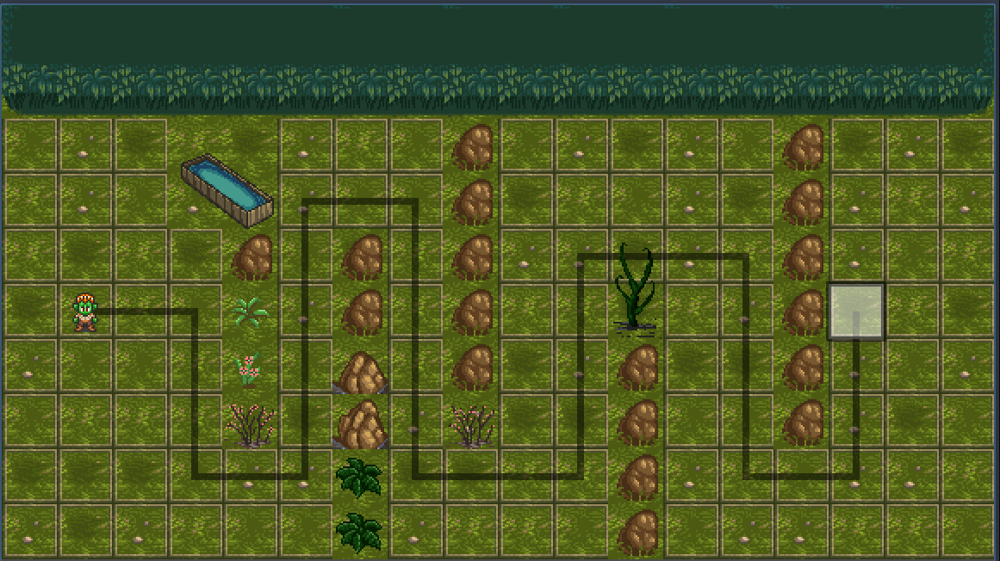

# Turn-Based Tactical Strategy Card Game



A small prototype for a turn-based tactical strategy card game built using the Godot Engine.

## 🎮 Project Overview

This is a tactical strategy game where players use cards to perform actions on a grid-based battlefield. The gameplay is inspired by classic tactics games and card-based mechanics.

### Features (WIP):

- Turn-based movement on a grid
- Card-based action system
- Basic player and enemy units
- Simple tile-based map

## 🛠️ Built With:

- **Engine:** [Godot Engine](https://godotengine.org/) (Version 4.4.1)
- **Language:** GDScript
- **Art / Assets:** hyptosis_tile-art-batch-1 [OpenGameArt.org](https://opengameart.org/)

## 🚀 Getting Started:

1. Download or clone the repository:

```bash
git clone https://github.com/Natanielsr/turn-based-tatic-strategy-card-game.git
